# 系統架構設計

本文檔說明 Daily Tick Runner 的系統架構、技術選型理由和設計原則。

## 📋 目錄

- [系統架構總覽](#系統架構總覽)
- [技術選型](#技術選型)
- [核心設計原則](#核心設計原則)
- [架構層級](#架構層級)
- [執行流程](#執行流程)
- [安全架構](#安全架構)
- [可觀測性設計](#可觀測性設計)
- [韌性與容錯](#韌性與容錯)

## 系統架構總覽



## 技術選型

### 核心框架：Playwright

**選擇理由：**

1. **內建 Auto-waiting**
   - 自動等待元素可互動
   - 減少 flaky tests
   - 不需手動管理等待

2. **優異的除錯能力**
   - Trace Viewer 完整記錄執行過程
   - 時間旅行除錯
   - 自動截圖和錄影

3. **現代化 API**
   - Locator API 提供穩定選擇器
   - Web-first assertions 自動重試
   - 原生 TypeScript 支援

4. **跨瀏覽器支援**
   - Chromium、Firefox、WebKit
   - 行動裝置模擬
   - 地理位置和時區模擬

**對比 Selenium：**
- Selenium 需要顯式等待管理
- 缺乏內建的除錯工具
- API 較為冗長
- 社群逐漸轉向 Playwright

### 排程系統

#### GitHub Actions（雲端）
- 免費額度充足（2000分鐘/月）
- 內建 secrets 管理
- 簡單的 cron 語法
- 自動化 CI/CD 整合

#### APScheduler（本地）
- 精確的時區控制
- Jitter 避免同時觸發
- 豐富的觸發器類型
- Python 生態系整合

### 通知服務

#### Discord Webhook
- 簡單的 HTTP API
- 支援 Rich Embed
- 無需認證複雜度
- 即時送達

#### LINE Messaging API
- 台灣普及率高
- 官方 SDK 支援
- 訊息類型豐富
- 企業級可靠性

## 核心設計原則

### 1. 關注點分離（Separation of Concerns）

```
流程邏輯 ←→ 頁面操作 ←→ 基礎設施
   ↓           ↓           ↓
Flows      Page Objects  Utilities
```

- **Flows**：業務流程（登入、打卡）
- **Pages**：UI 互動邏輯
- **Utils**：通用工具函式

### 2. 冪等性（Idempotency）

每次執行都應該是安全的，可重複執行：

```typescript
// 執行前檢查狀態
if (await isAlreadyCheckedIn()) {
  console.log('Already checked in today');
  return;
}

// 執行操作
await performCheckIn();

// 驗證結果
await verifyCheckInSuccess();
```

### 3. 防禦性程式設計

```typescript
// 多層驗證
async function safeCheckIn() {
  // 1. 政策檢查
  if (!isWithinTimeWindow()) {
    throw new PolicyError('Outside allowed time window');
  }
  
  // 2. 前置條件
  if (!await isLoggedIn()) {
    await performLogin();
  }
  
  // 3. 執行與驗證
  try {
    await clickCheckInButton();
    await verifySuccess();
  } catch (error) {
    await captureEvidence();
    throw error;
  }
}
```

### 4. 證據優先（Evidence-First）

失敗時自動保留：
- 截圖
- HTML 內容
- 網路請求記錄
- 執行追蹤

### 5. 12-Factor App 原則

- **設定進環境**：不硬編碼密碼
- **依賴明確宣告**：package.json
- **開發生產一致**：Docker 容器
- **日誌當作事件流**：結構化日誌

## 架構層級

### 第一層：觸發層（Trigger Layer）

負責啟動執行流程：

| 觸發源 | 使用場景 | 特點 |
|--------|----------|------|
| GitHub Actions | 生產環境 | 雲端執行、自動排程 |
| Local Scheduler | 備用方案 | 本地控制、低延遲 |
| Manual CLI | 除錯測試 | 即時執行、參數控制 |

### 第二層：編排層（Orchestration Layer）

流程控制器負責：
1. 載入設定
2. 政策檢查
3. 執行協調
4. 結果回報

### 第三層：執行層（Execution Layer）

#### Policy Engine
- 時間窗口檢查
- 地理位置驗證
- 假日排除
- 重複執行防護

#### Automation Engine
- Playwright 瀏覽器控制
- Page Object 模式
- 自動等待和重試
- 證據收集

#### Notify Service
- 多通道通知
- 失敗警告
- 執行報告
- 截圖附件

## 執行流程

### 完整執行生命週期



### 關鍵決策點

1. **政策檢查**
   - 工作日判斷
   - 時間窗口驗證
   - 黑名單日期

2. **認證管理**
   - Session 復用
   - Token 更新
   - 失效重登

3. **執行策略**
   - 重試機制
   - 超時控制
   - 錯誤分類

## 安全架構

### 密鑰管理



**原則：**
- 永不提交密碼到版本控制
- 使用環境變數注入
- 定期輪換密鑰
- 最小權限原則

### 敏感資料保護

1. **Storage State**
   - 包含 cookies 和 tokens
   - 加入 .gitignore
   - 定期清理過期檔案

2. **日誌脫敏**
   - 不記錄密碼
   - 遮蔽個人資訊
   - 結構化日誌格式

3. **Artifacts 安全**
   - 限制存取權限
   - 設定保留期限
   - 加密傳輸

### OWASP 最佳實踐

遵循 OWASP 指南：
- Secrets Management Cheat Sheet
- Logging Cheat Sheet
- Authentication Cheat Sheet

## 可觀測性設計

### 三支柱

#### 1. Metrics（指標）
- 執行次數
- 成功率
- 響應時間
- 重試次數

#### 2. Logging（日誌）
```typescript
logger.info('CheckIn started', {
  timestamp: new Date().toISOString(),
  userId: config.username,
  actionType: 'checkin',
  environment: process.env.NODE_ENV
});
```

#### 3. Tracing（追蹤）
- Playwright Trace
- 執行時間線
- 網路請求
- DOM 快照

### 監控層級

| 層級 | 監控內容 | 工具 |
|------|----------|------|
| 應用層 | 業務邏輯、成功率 | 自訂 metrics |
| 執行層 | 頁面載入、元素互動 | Playwright metrics |
| 基礎層 | CPU、記憶體、網路 | 系統監控 |

## 韌性與容錯

### 多層重試策略

入
```

### 錯誤分類與處理

| 錯誤類型 | 處理策略 | 範例 |
|----------|----------|------|
| 暫時性 | 自動重試 | 網路逾時、元素未載入 |
| 邏輯性 | 記錄並跳過 | 已打卡、非工作日 |
| 系統性 | 警告並停止 | 登入失敗、頁面改版 |
| 致命性 | 立即通知 | 帳號鎖定、服務中斷 |

### 降級策略

1. **主要路徑失敗**
   - 嘗試備用選擇器
   - 使用替代流程
   - 回退到手動模式

2. **通知失敗**
   - 主通道：Discord
   - 備用通道：LINE
   - 最終：寫入日誌

3. **瀏覽器失敗**
   - Chromium → Firefox
   - Headed → Headless
   - 本地 → 遠端

### 熔斷機制

```typescript
class CircuitBreaker {
  private failures = 0;
  private readonly threshold = 5;
  private readonly cooldown = 3600000; // 1 hour
  
  async execute(fn: Function) {
    if (this.failures >= this.threshold) {
      if (!this.shouldReset()) {
        throw new Error('Circuit breaker is open');
      }
      this.reset();
    }
    
    try {
      const result = await fn();
      this.onSuccess();
      return result;
    } catch (error) {
      this.onFailure();
      throw error;
    }
  }
}
```

## 效能優化

### 執行優化

1. **Session 復用**
   - 減少登入次數
   - 加快執行速度
   - 降低被偵測風險

2. **智慧等待**
   - 使用 Playwright auto-waiting
   - 避免固定 sleep
   - 條件式等待

3. **資源管理**
   - 及時釋放瀏覽器
   - 清理暫存檔案
   - 控制並發數

### 網路優化

1. **請求優化**
   - 阻擋不必要資源（圖片、字體）
   - 快取靜態資源
   - 壓縮傳輸

2. **重試策略**
   - 指數退避
   - 抖動（jitter）
   - 最大重試限制

## 擴展性設計

### 水平擴展

- 多帳號並行執行
- 分散式任務佇列
- 負載均衡

### 垂直擴展

- 增加單機資源
- 優化演算法
- 快取策略

### 模組化架構



## 未來展望

### 短期改進

1. 加入 AI 輔助判斷
2. 支援更多通知管道
3. 改善錯誤恢復機制

### 長期規劃

1. 微服務架構
2. 多租戶支援
3. 視覺化管理介面
4. 機器學習優化

## 參考資源

### 官方文檔
- [Playwright Documentation](https://playwright.dev)
- [GitHub Actions Documentation](https://docs.github.com/actions)
- [12-Factor App](https://12factor.net)

### 最佳實踐
- [OWASP Cheat Sheet Series](https://cheatsheetseries.owasp.org)
- [Martin Fowler - Page Object](https://martinfowler.com/bliki/PageObject.html)
- [Google Testing Blog](https://testing.googleblog.com)

### 設計模式
- [Circuit Breaker Pattern](https://martinfowler.com/bliki/CircuitBreaker.html)
- [Retry Pattern](https://docs.microsoft.com/azure/architecture/patterns/retry)
- [Idempotency](https://stripe.com/blog/idempotency)
