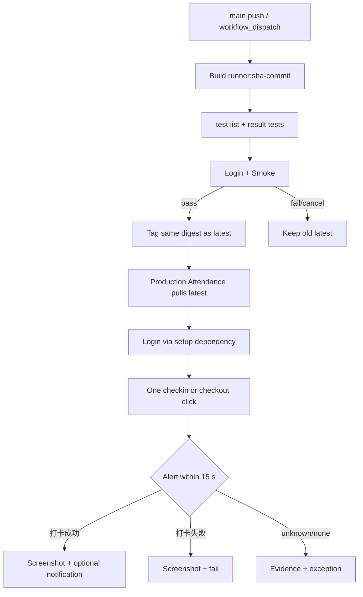

# 目前架構

Daily Tick Runner 是單一 Node.js／Playwright application，由 GitHub Actions 建置為容器並執行。系統沒有常駐服務或資料庫，排程入口只有 GitHub Actions。

## 元件

| 元件 | 責任 |
| --- | --- |
| `config/env.ts` | 在啟動瀏覽器前讀取並驗證必要設定 |
| `automation/pages/LoginPage.ts` | 登入頁操作 |
| `automation/pages/AttendancePage.ts` | 導航出勤頁、單次 click、判斷 alert 結果 |
| `automation/notify/` | 選用 Discord／LINE 通知 |
| `tests/setup/` | 登入並建立暫時的 Playwright storage state |
| `tests/check/*.smoke.spec.ts` | 登入後確認簽到／簽退 UI，不 click |
| `tests/check/*.click.spec.ts` | 使用者明確要求時執行一次真實操作 |
| `tests/check/attendance-result.spec.ts` | 本機模擬成功、失敗、未知與 timeout |
| `docker/Dockerfile` | Node 24+、Playwright 1.61.0 與 Chromium 執行環境 |
| `ci.yml` | 建置候選、Smoke、推進 stable image |
| `production-schedule.yml` | 以 stable image 手動或選用排程執行 |

## Image 與執行資料流


```mermaid
flowchart TD
    S[main push / workflow_dispatch] --> B[Build runner:sha-commit]
    B --> L[test:list + result tests]
    L --> M[Login + Smoke]
    M -->|pass| P[Tag same digest as latest]
    M -->|fail/cancel| K[Keep old latest]
    P --> R[Production Attendance pulls latest]
    R --> A[Login via setup dependency]
    A --> C[One checkin or checkout click]
    C --> O{Alert within 15 s}
    O -->|打卡成功| N[Screenshot + optional notification]
    O -->|打卡失敗| F[Screenshot + fail]
    O -->|unknown/none| X[Evidence + exception]
```

Image 名稱在 workflow runtime 從小寫的 `github.repository` 產生，所以每個 Fork 使用自己的 `ghcr.io/<owner>/<repo>/runner`。

## Playwright projects

- `setup`：驗證設定、登入並寫入 `playwright/.auth/state.json`。
- `chromium-smoke`：依賴 `setup`，只執行標記 `@smoke` 的安全檢查。
- `chromium-click`：依賴 `setup`，只執行 `@click`，且 project retries 固定為 0。
- `result`：使用本機 HTML 模擬結果，不登入外部服務。
- `notify`：只在明確執行 `npm run notify:test` 時測試通知 API。

全域 retry 只服務安全測試。正式 workflow 沒有外層 retry action，真實 click project 也沒有 Playwright retry，因此單次 run 不會因失敗或 timeout 自動再打卡。

## 結果模型

`AttendanceResult` 是 discriminated union：

```ts
type AttendanceResult =
  | { status: 'success'; title: '打卡成功'; detail?: string }
  | { status: 'failure'; title: '打卡失敗'; detail?: string };
```

成功與已知失敗都是可辨識結果；未知標題與 15 秒 timeout 使用例外。呼叫端在 failure 或例外時先保存畫面，再讓測試與 workflow 失敗。

## 設定與秘密邊界

必要值只有六個：`BASE_URL`、`COMPANY_CODE`、`AOA_USERNAME`、`AOA_PASSWORD`、`AOA_LAT`、`AOA_LON`。本機由 `.env` 注入，GitHub 由 Repository Secrets 注入。`.dockerignore` 排除 `.env*`（保留範例）、authentication state、截圖與測試產物，這些資料不會成為 image layer。

通知設定為選用。Smoke job 不接收通知 Secrets，也不呼叫通知 API；Production 只有在結果成功時呼叫成功通知。
