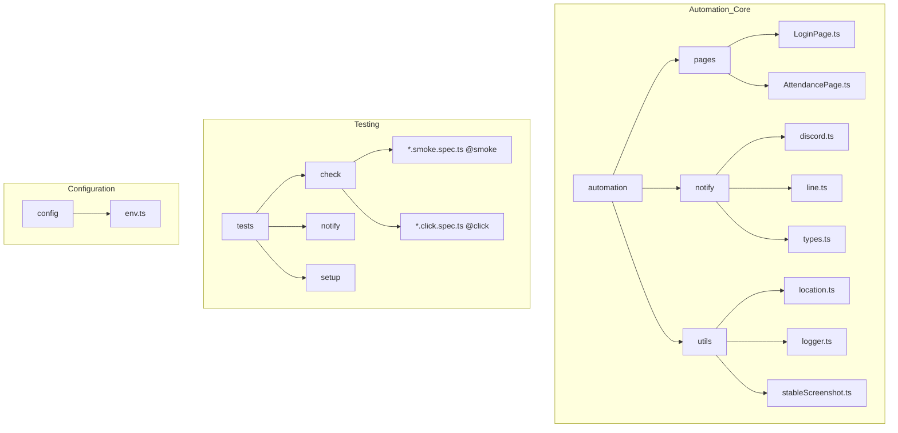

# CLAUDE.md

This file provides guidance to Claude Code (claude.ai/code) when working with code in this repository.

## 🏗️ Project Overview

Daily Tick Runner is an automated attendance system built with Playwright that performs automated check-in/check-out operations on AOA cloud systems. It supports both GitHub Actions scheduling and local scheduling, with notification capabilities via Discord and LINE.

## 🛠️ Common Commands

### Development & Testing
```bash
# Install dependencies
npm install

# Install Playwright browsers
npx playwright install chromium

# Environment setup and login
npm run test:setup

# Run smoke tests (UI validation without actual clicks)
npm run test:smoke

# Run actual check-in/check-out (click tests)
npm run test:click

# Test notification systems
npm run test:notify

# Run all tests
npm run test:all

# Interactive testing with UI
npm run test:ui

# Debug mode
npm run test:debug
```

### Playwright Commands
```bash
# Run specific test file
npx playwright test tests/check/checkin.smoke.spec.ts

# Run tests with specific project configuration
npx playwright test --project=chromium-smoke
npx playwright test --project=chromium-click
npx playwright test --project=notify

# Run tests with specific tags
npx playwright test --grep "@smoke"
npx playwright test --grep "@click"
npx playwright test --grep "@notify"

# Debug with headed browser
npx playwright test --headed --workers=1

# Generate test code
npx playwright codegen https://erpline.aoacloud.com.tw/

# View test reports
npx playwright show-report

# View trace files
npx playwright show-trace test-results/**/trace.zip
```

### Single Test Execution
```bash
# Run specific check-in test
npx playwright test tests/check/checkin.click.spec.ts --project=chromium-click

# Run specific notification test
npx playwright test tests/notify/discord.spec.ts --project=notify
```

## 🏛️ Architecture Overview

### Core Structure



<!-- Original directory structure
```
automation/
├── pages/              # Page Object Model implementations
│   ├── LoginPage.ts   # Handles login functionality
│   └── AttendancePage.ts # Handles check-in/check-out
├── notify/            # Notification services
│   ├── discord.ts     # Discord webhook integration
│   ├── line.ts        # LINE Messaging API
│   └── types.ts       # Notification type definitions
└── utils/             # Utility functions
    ├── location.ts    # GPS location handling
    ├── logger.ts      # Logging system
    └── stableScreenshot.ts # Screenshot utilities

tests/
├── check/             # Attendance testing
│   ├── *.smoke.spec.ts # UI validation tests (@smoke)
│   └── *.click.spec.ts # Actual action tests (@click)
├── notify/            # Notification testing (@notify)
└── setup/             # Environment setup tests (@setup)

config/
└── env.ts             # Environment variable management
```
-->

### Test Projects Configuration

The project uses Playwright's project-based configuration:

- **setup**: Environment validation and authentication setup
- **chromium-smoke**: UI validation tests without actual clicks (safe for CI)
- **chromium-click**: Real action tests that perform actual check-in/check-out
- **notify**: Notification system testing

### Page Object Pattern

The codebase follows the Page Object Model pattern:

- `LoginPage`: Handles login with company code, username, and password
- `AttendancePage`: Manages navigation to attendance page and check-in/check-out actions

Key implementation details:
- Uses Playwright's modern locator strategies (getByRole, getByPlaceholder)
- Implements auto-waiting patterns
- Includes proper error handling and verification

### Environment Configuration

Environment variables are managed through `config/env.ts` with strict validation:

**Required Variables:**
- `BASE_URL`: AOA system URL
- `COMPANY_CODE`: Company identifier
- `AOA_USERNAME`: Login username
- `AOA_PASSWORD`: Login password
- `AOA_LAT`, `AOA_LON`: GPS coordinates
- `TZ`: Timezone (Asia/Taipei)
- `LOCALE`: Locale setting (zh-TW)

**Optional Variables:**
- `DISCORD_WEBHOOK_URL`: Discord notification endpoint
- `LINE_CHANNEL_ACCESS_TOKEN`, `LINE_USER_ID`: LINE notification setup
- `LOG_LEVEL`: Logging verbosity

### Test Execution Strategy

The system uses a multi-layered approach:

1. **Smoke Tests (@smoke)**: Validate UI elements without performing actions
2. **Click Tests (@click)**: Execute actual attendance operations
3. **Notification Tests (@notify)**: Verify notification delivery
4. **Setup Tests (@setup)**: Environment and authentication validation

### CI/CD Integration

GitHub Actions workflows:
- `ci.yml`: Pull request and main branch testing
- `production-schedule.yml`: Scheduled attendance automation
- `test-schedule.yml`: Test scheduling workflow
- `build-image.yml`: Custom Docker image building

Uses custom container image: `ghcr.io/liu-chun-wu/daily-tick-runner/runner:latest` with:
- Pre-installed Playwright browsers
- Chinese font support
- Consistent execution environment

### Error Handling & Resilience

- Multi-level retry strategy (test level, action level, CI level)
- Automatic screenshot and trace capture on failures
- Circuit breaker patterns for stability
- Comprehensive logging and monitoring

### Security Considerations

- Sensitive data managed via GitHub Secrets and environment variables
- Storage state files excluded from version control
- No hardcoded credentials in code
- Secure artifact handling with retention policies

## 🔍 Development Workflow

1. **Local Development**: Use smoke tests for UI validation
2. **Feature Testing**: Use click tests for actual functionality
3. **CI Integration**: Automated smoke and notification tests
4. **Production Deployment**: Scheduled click tests via GitHub Actions

## 📚 Key Documentation References

- [ARCHITECTURE.md](./ARCHITECTURE.md): Detailed system architecture and design principles
- [DEVELOPMENT.md](./DEVELOPMENT.md): Complete development guide with best practices
- [DEPLOYMENT.md](./DEPLOYMENT.md): GitHub Actions deployment setup
- [LOCAL-SCHEDULER.md](./LOCAL-SCHEDULER.md): macOS local scheduling configuration