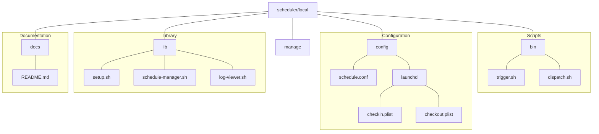
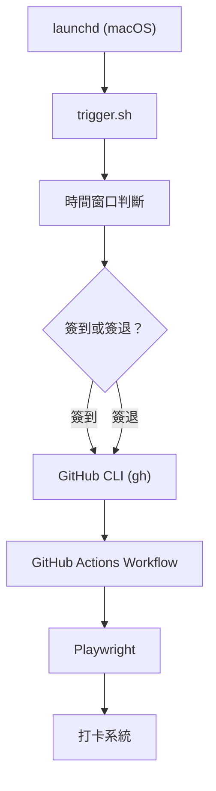
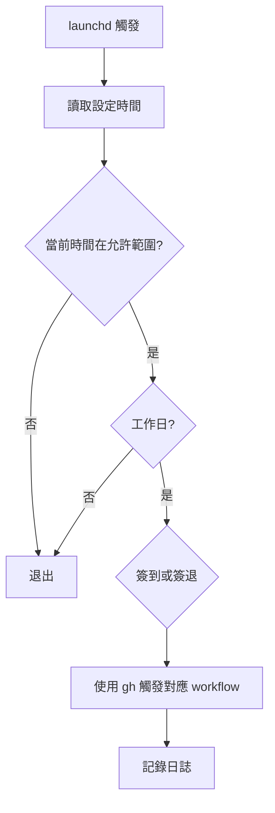
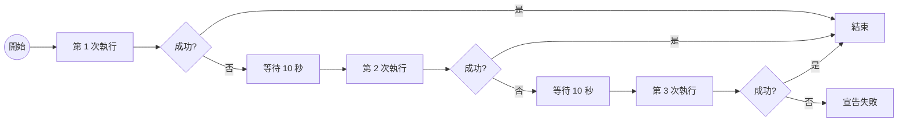

# 本地排程器 (macOS)

使用本地 Mac 電腦觸發 GitHub Actions，提供更可靠的排程執行方案。

## 🎯 為什麼需要本地排程器？

GitHub Actions 的免費版排程可能會有延遲或不執行的情況，特別是在高峰時段。本地排程器透過 macOS 的 launchd 服務，確保準時觸發 GitHub Actions workflow。

## 📋 目錄

- [系統需求](#系統需求)
- [快速安裝](#快速安裝)
- [管理命令](#管理命令)
- [進階設定](#進階設定)
- [運作原理](#運作原理)
- [疑難排解](#疑難排解)

## 系統需求

- macOS 10.15 或更新版本
- GitHub CLI (`gh`) 已安裝並登入
- 網路連線（用於觸發 GitHub Actions）
- 電腦需保持開機狀態

### 安裝 GitHub CLI

```bash
# 使用 Homebrew 安裝
brew install gh

# 登入 GitHub
gh auth login
```

## 快速安裝

### 1. 進入排程器目錄

```bash
cd scheduler/local
```

### 2. 執行安裝

```bash
# 互動式安裝（推薦）
./manage install

# 或直接安裝（跳過確認）
./manage install --force
```

安裝程式會：
- 檢查系統需求
- 建立必要目錄
- 安裝 launchd 排程任務
- 設定預設執行時間（08:30 簽到、18:00 簽退）

## 管理命令

### 統一管理入口

所有操作都透過 `./manage` 指令完成：

```bash
# 查看所有可用命令
./manage help
```

### 常用命令

| 命令 | 說明 | 範例 |
|------|------|------|
| `install` | 安裝定時任務 | `./manage install` |
| `uninstall` | 卸載定時任務 | `./manage uninstall` |
| `status` | 查看完整狀態（含時間資訊） | `./manage status` |
| `dispatch` | 直接觸發 workflow | `./manage dispatch checkin` |
| `logs` | 查看執行日誌 | `./manage logs latest` |
| `update-time` | 更新執行時間 | `./manage update-time` |

### 狀態檢查

```bash
# 查看完整狀態（增強版）
./manage status
```

顯示內容：
- ✅ 安裝狀態
- ✅ GitHub CLI 認證狀態
- 🕰 當前時間與排程時間
- 📅 最後執行時間
- ⏰ 下次執行時間
- 📊 最近執行結果

### 直接觸發 Workflow

```bash
# 直接觸發測試 workflow 簽到（預設 DEBUG 模式）
./manage dispatch checkin

# 觸發正式 workflow 簽退
./manage dispatch checkout production

# 觸發測試 workflow 簽到+簽退，INFO 模式
./manage dispatch both test INFO

# 查看 dispatch 幫助
./manage dispatch help
```

參數說明：
- `action_type`：checkin/checkout/both
- `workflow`：test（預設）/production
- `log_level`：DEBUG（預設）/INFO/WARN/ERROR

### 日誌管理

```bash
# 查看最新日誌（預設 50 行）
./manage logs latest

# 查看今日日誌
./manage logs today

# 即時監控日誌
./manage logs monitor

# 查看日誌統計
./manage logs stats

# 搜尋特定內容
./manage logs search "ERROR"

# 清理舊日誌（保留 30 天）
./manage logs cleanup
```

### 時間設定

```bash
# 互動式更新時間
./manage update-time

# 快速設定（24小時制）
./manage update-time 9 0 18 30  # 9:00 簽到, 18:30 簽退
```


## 進階設定

### 目錄結構



<!-- Original directory structure
```
scheduler/local/
├── bin/
│   ├── trigger.sh          # 主程式 - 檢查時間並觸發
│   └── dispatch.sh         # 直接觸發 workflow（新增）
├── config/
│   ├── schedule.conf       # 時間設定
│   └── launchd/           # macOS 排程配置
│       ├── checkin.plist   # 簽到任務
│       └── checkout.plist  # 簽退任務
├── lib/
│   ├── setup.sh           # 安裝工具
│   ├── schedule-manager.sh # 時間管理
│   └── log-viewer.sh      # 日誌檢視
├── docs/
│   └── README.md          # 詳細文檔
└── manage                 # 統一管理入口（增強）
```
-->

### 時間配置檔

編輯 `config/schedule.conf` 可自訂時間：

```bash
# 簽到時間
CHECKIN_HOUR=8
CHECKIN_MINUTE=30

# 簽退時間  
CHECKOUT_HOUR=18
CHECKOUT_MINUTE=0

# 工作日設定（1=週一, 5=週五）
WORKDAYS=(1 2 3 4 5)
```

### 手動編輯 launchd

如需更細緻的控制，可直接編輯 plist 檔案：

```bash
# 編輯簽到排程
nano ~/Library/LaunchAgents/com.daily-tick-runner.checkin.plist

# 重新載入
launchctl unload ~/Library/LaunchAgents/com.daily-tick-runner.checkin.plist
launchctl load ~/Library/LaunchAgents/com.daily-tick-runner.checkin.plist
```

## 運作原理

### 執行流程

<!-- ```
launchd (macOS)
    ↓ 定時觸發
trigger.sh
    ↓ 判斷時間
GitHub CLI (gh)
    ↓ 觸發 workflow
GitHub Actions
    ↓ 執行打卡
Playwright
    ↓ 瀏覽器自動化
打卡系統
``` -->

### 時間判斷邏輯

1. **launchd 觸發**：在設定的時間點執行 trigger.sh
2. **時間窗口判斷**：檢查當前時間是否在允許範圍內
3. **動作類型決定**：判斷應執行簽到或簽退
4. **觸發 workflow**：使用 gh CLI 觸發對應的 GitHub Actions

### 重試機制

內建三次重試機制，每次間隔 10 秒：

```bash
# trigger.sh 內建重試
MAX_RETRIES=3
RETRY_DELAY=10
```

### 日誌記錄

日誌儲存位置：
- 主日誌：`~/.daily-tick-runner/logs/auto-punch-YYYYMM.log`
- 簽到日誌：`~/.daily-tick-runner/logs/checkin.log`
- 簽退日誌：`~/.daily-tick-runner/logs/checkout.log`

## 疑難排解

### 常見問題

#### 排程未執行

1. 檢查 launchd 狀態：
```bash
./manage status
launchctl list | grep daily-tick-runner
```

2. 檢查系統偏好設定：
- 系統偏好設定 → 安全性與隱私 → 隱私權 → 完全磁碟存取
- 確保 Terminal 有權限

3. 檢查電腦是否休眠：
- 系統偏好設定 → 節能 → 防止電腦自動進入睡眠

#### GitHub CLI 認證失敗

```bash
# 重新登入
gh auth logout
gh auth login

# 檢查認證狀態
gh auth status
```

#### 時間不正確

1. 檢查系統時區：
```bash
date
sudo systemsetup -gettimezone
```

2. 更新排程時間：
```bash
./manage update-time
```

#### 日誌錯誤

查看詳細錯誤：
```bash
# 查看錯誤日誌
./manage logs search ERROR

# 查看 launchd 錯誤
tail -f ~/.daily-tick-runner/logs/checkin.error.log
```

### 完全重置

如果遇到無法解決的問題，可以完全重置：

```bash
# 1. 卸載現有排程
./manage uninstall

# 2. 清理所有設定
rm -rf ~/.daily-tick-runner

# 3. 重新安裝
./manage install
```

### 暫時停用

如需暫時停用排程，直接使用卸載命令：

```bash
# 卸載排程
./manage uninstall

# 需要時重新安裝
./manage install
```

## 安全注意事項

1. **GitHub Token 安全**
   - GitHub CLI 的認證 token 儲存在系統 keychain
   - 定期更新 token（`gh auth refresh`）

2. **日誌隱私**
   - 日誌可能包含執行細節
   - 定期清理舊日誌（`./manage logs cleanup`）

3. **權限管理**
   - 只給予必要的檔案系統權限
   - 避免使用 root 權限執行

## 進階功能

### 自訂 Workflow

可以修改 `bin/trigger.sh` 來觸發不同的 workflow：

```bash
# 編輯觸發腳本
nano bin/trigger.sh

# 修改 WORKFLOW_NAME 變數
WORKFLOW_NAME="your-custom-workflow.yml"
```

### 多帳號支援

複製設定檔並修改：

```bash
# 複製設定
cp -r scheduler/local scheduler/local-account2

# 修改設定
cd scheduler/local-account2
# 編輯 config/schedule.conf 和 plist 檔案
```

### 通知整合

可以在 `bin/trigger.sh` 加入通知：

```bash
# macOS 原生通知
osascript -e 'display notification "打卡已觸發" with title "Daily Tick Runner"'

# 或使用 terminal-notifier
terminal-notifier -title "Daily Tick Runner" -message "打卡已觸發"
```

## 效能優化

### 減少資源使用

1. 調整日誌保留期限
2. 限制重試次數
3. 優化時間窗口判斷

### 監控建議

1. 使用 `./manage logs stats` 定期檢查執行統計
2. 設定失敗警告（整合到 Discord/LINE）
3. 每週檢查一次執行記錄

## 相關文件

- [完整文檔](./scheduler/local/docs/README.md)
- [GitHub Actions 部署](./DEPLOYMENT.md)
- [開發指南](./DEVELOPMENT.md)
- [系統架構](./ARCHITECTURE.md)

## 支援

如有問題，請參考：
1. 本文檔的疑難排解章節
2. 查看日誌：`./manage logs latest`
3. 提交 Issue 到 GitHub 專案