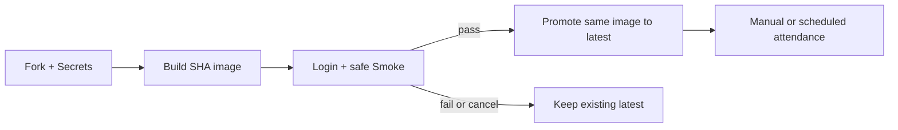

# Daily Tick Runner

使用 Playwright 與 GitHub Actions，替已取得授權的使用者執行 AOA 出勤頁面檢查、簽到與簽退。

> 僅能用於你有權操作的帳號與系統。真實打卡具有外部副作用；GitHub Actions 排程可能延遲，尖峰時甚至可能被丟棄，不能視為準時保證。

## 最短使用流程

1. Fork 此專案，在 Fork 的 **Actions** 頁啟用 workflows。
2. 到 **Settings → Secrets and variables → Actions → Repository secrets** 建立下表六個必填 Secrets。
3. 到 **Actions → Build & Smoke Test → Run workflow** 手動執行一次。
4. 確認所有 jobs 通過，且 Fork 自己的 GHCR 已產生 `runner:latest`。
5. 到 **Actions → Production Attendance → Run workflow**，選擇 `checkin` 或 `checkout`。

`Build & Smoke Test` 只會登入並檢查頁面，不會點擊簽到／簽退，也不會發送測試通知。第一次 Fork 必須手動執行它，正式流程才有可用的 `latest` image。

## 必填 Repository Secrets

| Secret | 用途 | 範例格式 |
| --- | --- | --- |
| `BASE_URL` | 已授權的 AOA 服務網址 | `https://attendance.example.com/` |
| `COMPANY_CODE` | 公司代碼 | `your_company_code` |
| `AOA_USERNAME` | 登入帳號 | `your_username` |
| `AOA_PASSWORD` | 登入密碼 | 強密碼 |
| `AOA_LAT` | 瀏覽器地理位置緯度 | `0` 到 `90` 或負值 |
| `AOA_LON` | 瀏覽器地理位置經度 | `0` 到 `180` 或負值 |

選填通知 Secrets：

| Secret | 用途 |
| --- | --- |
| `DISCORD_WEBHOOK_URL` | 成功或 workflow 失敗通知 |
| `LINE_CHANNEL_ACCESS_TOKEN` | LINE Messaging API token |
| `LINE_USER_ID` | LINE 通知對象 |

`TZ=Asia/Taipei`、`LOCALE=zh-TW`、`LOG_LEVEL=INFO` 有安全預設。正式 workflow 的日誌等級可在手動執行時選擇。

## 執行流程



每次 `main` push 或手動執行會建立 `runner:sha-<commit>`。只有該候選 image 完成載入檢查、結果判斷測試與安全 Smoke 後，同一 image 才會被標記為 `latest`。失敗或取消不會把未驗證版本推進為 `latest`。

Pull request 沒有 Repository Secrets，因此只建置本機 image 並執行無外部副作用的載入檢查；不登入 AOA，也不推送 GHCR。

## 命令安全性

先建立本機設定：

```bash
cp .env.example .env
npm ci
```

| 命令 | 外部副作用 | 說明 |
| --- | --- | --- |
| `npm run test:list` | 無 | 載入設定並列出測試 |
| `npm run test:result` | 無 | 本機模擬四種結果，驗證只 click 一次 |
| `npm test` / `npm run test:smoke` | 登入；不打卡、不通知 | 檢查登入與出勤頁 UI |
| `npm run smoke:notify` | 登入並**發送訊息**；不打卡 | Smoke 全部成功後發送一則摘要 |
| `npm run notify:test` | **會發送訊息** | 手動驗證 Discord／LINE |
| `npm run attendance:checkin` | **會真實簽到一次** | 不自動重按 |
| `npm run attendance:checkout` | **會真實簽退一次** | 不自動重按 |

需要 Node.js 24+。Playwright package 與 Docker browser image 固定為 `1.61.0`。

## 選用排程

排程預設停用。請先在 [Production workflow](.github/workflows/production-schedule.yml) 填入 `CHECKIN_CRON` 與 `CHECKOUT_CRON`，再取消 `schedule` 區塊註解。workflow 使用 `timezone: Asia/Taipei`，不需要手動換算 UTC。

GitHub 明確說明 schedule 在高負載時可能延遲，排隊工作也可能被捨棄；如果準時性是硬性需求，這個專案不適合該情境。完整設定與 image 生命週期請讀 [DEPLOYMENT.md](DEPLOYMENT.md)。

## 文件

- [部署與 Fork 初始化](DEPLOYMENT.md)
- [目前架構](ARCHITECTURE.md)
- [開發與測試](DEVELOPMENT.md)
- [安全指南](docs/SECURITY.md)
- [疑難排解](docs/TROUBLESHOOTING.md)

## 支援與授權

請透過此 repository 的 Issues 回報問題；附上 workflow 名稱、run 連結與已遮蔽的錯誤訊息，不要貼出 Secrets、登入畫面或 authentication state。

本專案採用 [MIT License](LICENSE)。

參考：[GitHub Actions Secrets](https://docs.github.com/en/code-security/reference/secret-security/secret-types)、[使用 GITHUB_TOKEN 發佈 package](https://docs.github.com/en/packages/managing-github-packages-using-github-actions-workflows/publishing-and-installing-a-package-with-github-actions)、[schedule 事件](https://docs.github.com/en/actions/reference/workflows-and-actions/events-that-trigger-workflows#schedule)、[Playwright Docker](https://playwright.dev/docs/docker)。
